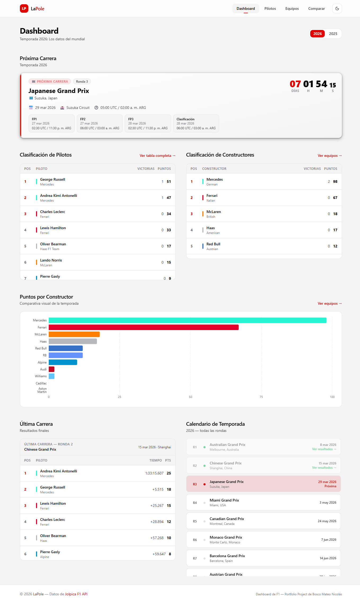
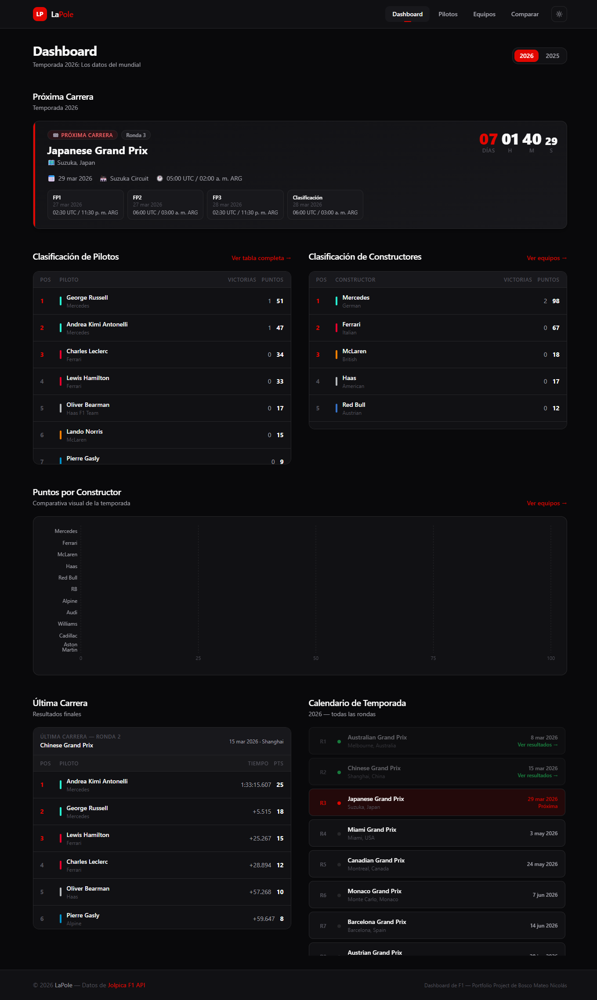
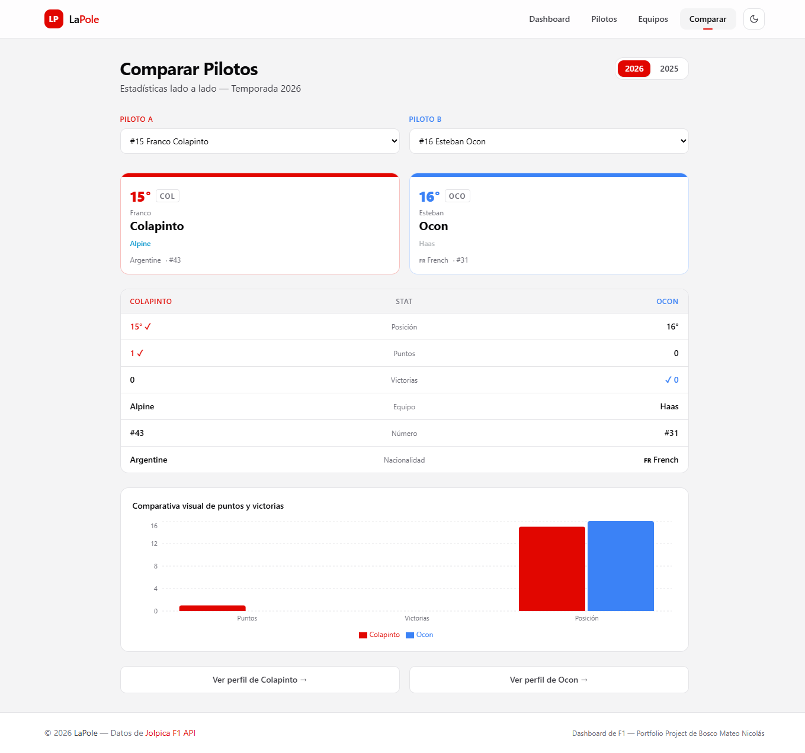
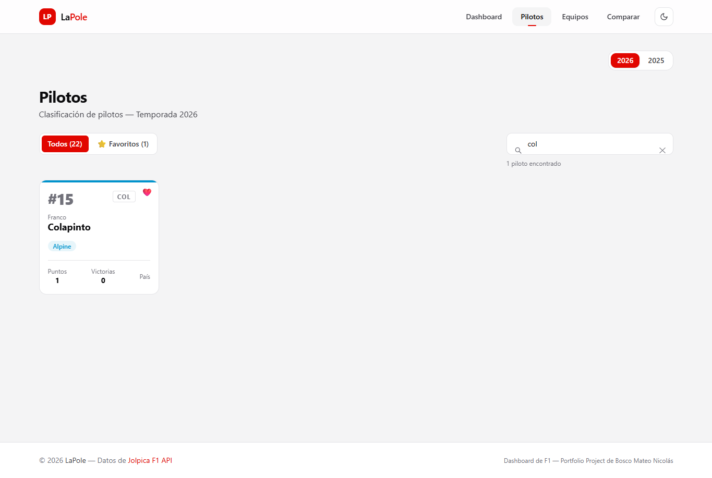
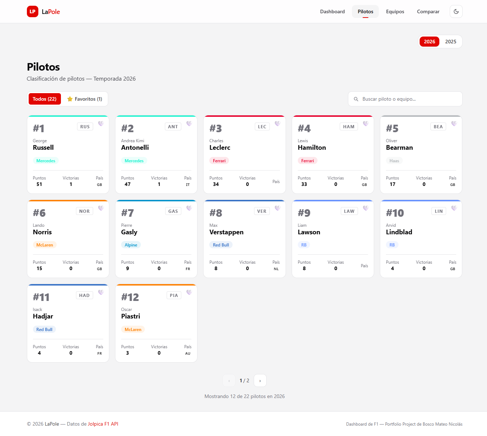
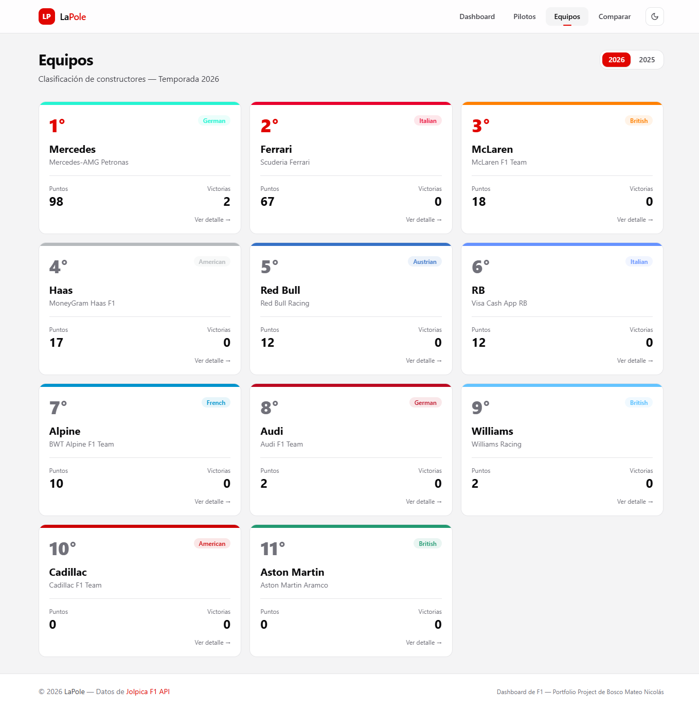

# LaPole

LaPole es un dashboard de Fórmula 1 hecho con Next.js para consultar la temporada actual y la anterior con una UI enfocada en standings, resultados, calendario y comparativas.

## Qué resuelve

- Vista principal con próxima carrera, standings, última fecha y calendario,
- Listado de pilotos con búsqueda, favoritos locales y paginación,
- Listado de constructores con fichas de detalle,
- Comparador de pilotos lado a lado,
- Páginas de detalle por piloto, equipo y carrera,
- Tema claro/oscuro persistido en `localStorage`.

## Stack

- **Next.js 16** + **React 19**
- **TypeScript** en modo estricto
- **Tailwind CSS v4**
- **Zod** para validar respuestas de la API
- **Recharts** para gráficos
- **Vitest** + **Testing Library** para pruebas unitarias

## Fuente de datos

Los datos se consumen desde la [Jolpica F1 API](https://api.jolpi.ca/ergast/).

## Cómo se organiza

```text
app/                rutas con App Router
components/         componentes de UI y bloques de dominio
lib/api/            cliente HTTP, schemas Zod y mappers
lib/utils/          helpers de formato y lógica de temporada
hooks/              favoritos, tema y paginación
constants/          configuración global y metadatos de equipos
types/              contratos tipados de dominio y API
__tests__/          pruebas de hooks, utilidades y componentes
docs/               capturas usadas en el README
```

## Decisiones técnicas

- **Validación antes de renderizar:** la respuesta externa se parsea con Zod antes de pasar a la UI.
- **Mapeo de datos de dominio:** la app no usa directamente el shape crudo de Jolpica; primero lo transforma a modelos más simples para render.
- **Temporadas recientes:** el selector trabaja con la temporada actual y la anterior calculadas dinámicamente a partir del año UTC actual.
- **Actualización periódica:** los datos usan `revalidate`, así que el contenido se refresca por intervalos en vez de prometer tiempo real absoluto.
- **Persistencia liviana en cliente:** favoritos y tema se guardan en `localStorage` sin sumar estado global innecesario.

## Ejecutar en local

```bash
git clone https://github.com/NicoBosco/lapole.git
cd lapole
npm install
npm run dev
```

Abrí [http://localhost:3000](http://localhost:3000).

## Scripts

- `npm run dev`: entorno de desarrollo
- `npm run build`: build de producción
- `npm run start`: correr el build generado
- `npm run lint`: lint del proyecto
- `npm run typecheck`: chequeo de TypeScript
- `npm run test`: suite de tests unitarios

## Testing

La aplicación cuenta con pruebas unitarias y de integración que validan sus funcionalidades principales:

- **Componentes de UI**: Verificación de renderizado y lógica condicional en elementos clave como `CountdownTimer`, listados y estados de error/vacíos.
- **Hooks y Storage**: Pruebas sobre la gestión del tema visual (`useTheme`), paginación y almacenamiento local de favoritos.
- **Capa de Datos**: Aserciones sobre el cliente HTTP, las funciones de transformación (`mappers`) y las utilidades de formato (`formatters.ts`).
- **Interacciones Complejas**: Mocks de navegación, selectores de temporada y filtros de búsqueda en las vistas principales.
- **SSR Mocking**: Comprobación del manejo asíncrono y los fallbacks de componentes de servidor.

Para ejecutar la suite de pruebas:

```bash
npm run test
```

## Limitaciones conocidas

- Depende de la disponibilidad y consistencia de la Jolpica F1 API,
- No incluye autenticación ni backend propio,
- La cobertura focaliza en la lógica pura, hooks y estados críticos aislados, quedando fuera flujos E2E de macro UI,
- El contenido se actualiza por revalidación, no por streaming o sockets.

## Demo

[https://lapole.vercel.app](https://lapole.vercel.app/)

## Screenshots

### Dashboard


### Dark mode


### Comparador de pilotos


### Búsqueda de pilotos


### Visualización de pilotos


### Visualización de equipos


## Nota

Proyecto personal de portfolio de Bosco Mateo Nicolás.
No está afiliado oficialmente a la Fórmula 1, la FIA ni a ningún equipo.